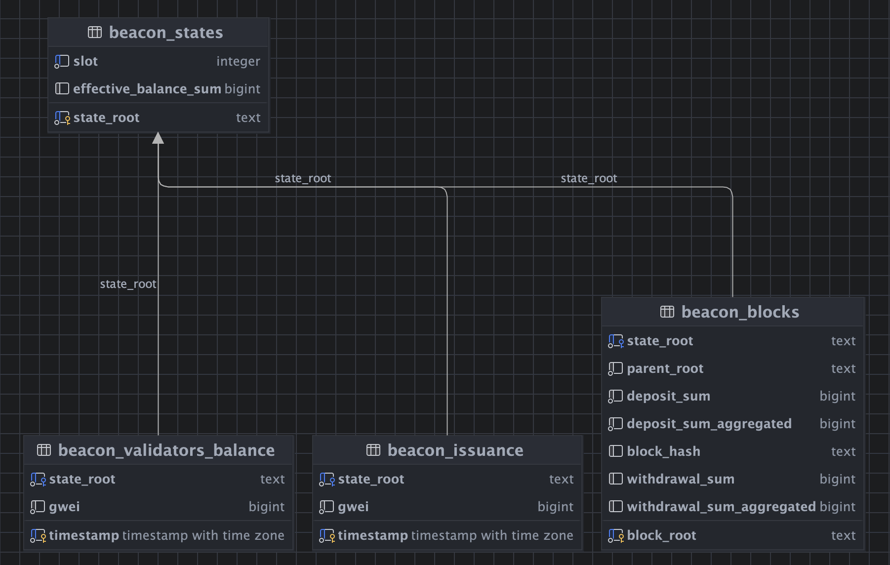

# BeaconChain Tables

## ER Diagram

- Based on the above ER diagram image, here is the description of each table and how they related to the Beacon Chain
  datasets.

## Schema Description: Ethereum Beacon Chain Data Model

### `beacon_states`

- **Description**: This table stores the state of the Ethereum Beacon Chain at different slots.
- **Columns**:
    - `slot (integer)`: The slot number in the Beacon Chain.
    - `effective_balance_sum (bigint)`: The total effective balance of all validators at this slot.
    - `state_root(text)`: The root hash of the state at this slot, used for verifying the integrity of the state.

- **API Reference**: Equivalent to the `beacon/state/{state_id}` endpoint in the Beacon API, which retrieve full state
  details for a given slot or state root.

--- 

### `beacon_blocks`

- **Description**: Stores block-related data from the Beacon Chain.
- **Columns**:
    - `state_root (text)`: The state root associated with this block, linking it to the `beacon_states` table.
    - `parent_root (text)`: The hash of the parent block.
    - `deposit_sum (bigint)`: The sum of deposits in this block.
    - `deposit_sum_aggregated (bigint)`: The total aggregated deposit sum.
    - `block_hash (text)`: The hash of this block.
    - `withdrawal_sum (bigint)`: The sum of withdrawals in this block.
    - `withdrawal_sum_aggregated (bigint)`: The total aggregated withdrawal sum.
    - `block_root (text)`: The Merkle root hash of the block structure.

- **API Reference**: Corresponds to the `beacon/blocks/{block_id}` API, which provides block details for a given block
  root or slot.

--- 

### `beacon_issuance`

- **Description**: Stores validator balance at different state roots.
- **Column**:
    - `state_root (text)`: The state root linking this record to a specific state.
    - `gwei (bigint)`: The total amount of ETH held by validators at this state.
    - `timestamp (timestamp with timezone)`: The time this balance snapshot was taken.
- **API Reference**: Corresponds to `beacon/validators/{validator_id}/balances`, which provides balance details for
  specific validators at a given state.

--- 

### `beacon_validators_balance`

- **Description**: Stores validator balances at different state roots.
- **Columns**:
    - `state_root (text)`: The state root linking this record to a specific state.
    - `gwei (bigint)`: The total amount of ETH held by validators at this state.
    - `timestamp (timestamp with timezone)`: The time this balance snapshot was taken.
- **API Reference**: Corresponds to `beacon/validators/{validator_id}/balances`, which provides balance details for
  specific validators at a given state.

---

## Relationships & Data Flow

- `beacon_blocks` and `beacon_states` are linked through `state_root` each block reference a valid state.
- `beacon_issuance` and `beacon_validators_balance` also reference `state_root`, ensuring that validator balances and
  issuance are correctly attributed to a specific state in the chain.
- This schema helps track E's Proof-of-Stake(PoS) consensus data.

--- 

## Data Flow Diagram 

// todo 
